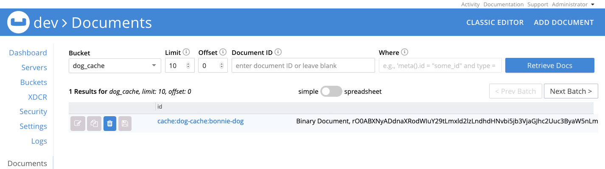

# Couchbase Spring Cache Demo

Example Spring Boot app using [couchbase-spring-cache] library, which is an "An implementation for Spring Cache based on Couchbase Java SDK 2.x".

This particular demo attempts to directly use the `com.couchbase.client.spring.cache.CouchbaseCache` object, rather than via the usual [Spring Cache] abstraction. An important thing to note with [couchbase-spring-cache] is that it will use [Java Serialization] to store values as a binary document. Therefore they will only be readable by similar JVM's on the other end.



## Integration Tests

### Run Integration Tests

A couchbase test server configured according to is required in order to run the integration tests. Instructions to set up such a server are provided in [Docker Couchbase Test Server](#DockerCouchbaseTestServer).

```bash
./gradlew test
```

### Docker Couchbase Test Server

1. spin up container

    ```bash
    docker run -d --name db -p 8091-8094:8091-8094 -p 11210:11210 couchbase:6.0.0
    ```

1. Visit [http://localhost:8091](http://localhost:8091) on the host machine to see the Web Console
1. Walk through the Setup wizard and accept the default values.
   - You may need to disable analytics if the defaults won't run in your environment.
1. Add a `dog_cache` bucket with default settings.
1. Navigate to `Security -> Add User` to create a new user called `dog_cache`, with password `password`, and `Application Access` permissions on `dog_cache` bucket.

For further information on the couchbase container, see [dockerhub.com/couchbase].

[Couchbase]: https://www.couchbase.com/
[Spring Data Couchbase]: https://spring.io/projects/spring-data-couchbase
[couchbase-spring-cache]: https://github.com/couchbaselabs/couchbase-spring-cache
[Spring Cache]: https://spring.io/guides/gs/caching/
[Java Serialization]: https://docs.oracle.com/javase/7/docs/api/java/io/Serializable.html
[dockerhub.com/couchbase]: https://hub.docker.com/_/couchbase